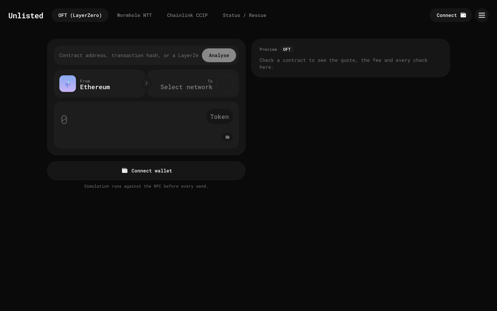

<h1 align="center">Unlisted</h1>

<p align="center">
  <b>Bridge any LayerZero OFT token — even the ones no bridge UI has listed.</b><br>
  Paste the contract, pick a chain and an amount. Unlisted reads everything else from the contract itself.
</p>

<p align="center">
  <a href="https://oft-bridge-ui.pages.dev"><b>oft-bridge-ui.pages.dev</b></a>
</p>

<p align="center">
  
</p>

<p align="center">
  <sub>Paste a contract and everything else — the token, its destinations, the quote and every check — is read from the chain and shown in the panel on the right.</sub>
</p>

---

## Why

Hundreds of tokens ship a LayerZero **OFT** bridge, but only a handful appear in Stargate or other bridge front-ends. For the rest, users are left calling `send()` by hand on a block explorer — eleven fields, 18-decimal amounts, and one typo away from losing funds.

Unlisted is the missing form. It is a static page: no backend, no database, no contracts of its own, nothing custodied. It reads the OFT contract, builds the exact `send` transaction, shows you every field, and hands it to your wallet.

## How it works

1. **Connect** a browser wallet and choose the source chain: MetaMask, Rabby, … for EVM chains; Phantom, Solflare, Backpack, … when the source is Solana.
2. **Paste** anything that identifies the token — the token itself is enough: when the pasted address is a plain ERC-20 and not the bridge, the same address on every other network is asked which contract on your network it names as its peer, and the adapter that comes back is checked like any pasted contract (it must lock exactly that token) before it is used. Otherwise: the OFT / OFTAdapter contract address (on Solana: the OFT Store address), the hash of any past bridge transaction on any supported chain, a Solana signature, or a LayerZero Scan link. Transactions are read from their **logs**, so a bridge that went through a router, an aggregator or a smart wallet is still resolved to the contract underneath — and a transaction sent on a different network is found there and offered with a "switch" button.
3. **Choose** a destination (only chains the contract actually has a peer on) and an amount.
   The address bar follows the form — `/bridge?from=ethereum&token=0x…&to=bsc`, and the same for `/ntt` and `/ccip` — so a route can be handed to someone as a link. Opening it fills in the network, the token and the destination, and the contract is read from the chain exactly as if it had been pasted. A link never carries the recipient or the amount: where the money goes is typed and confirmed by the person sending, and everyone has their own balance. Reloading the page is a fresh start — only a page arrived at through a link is filled in from it.
   The arrow between From and To reverses the route in one click: the destination becomes the source, the contract there is taken from this one's peer and checked again from scratch, and the amount stays — on every tab, for any pair of networks the contract has a route between.
4. **Review.** The quote, the fee, the recipient and the raw `amountLD` / `minAmountLD` are shown exactly as they will be sent, in a panel that stays in view. Twenty-two checks run, including a live simulation whose reverts are decoded into named errors (`NoPeer`, `SlippageExceeded`, `ERC20InsufficientAllowance`, `EnforcedPause`, …), and one small chip says how the route looks — green, yellow or red, with the reasons on hover. Nothing to tick.
5. **Approve, then Send.** One button: it approves exactly the amount to the verified contract when the allowance is short, waits for the receipt, reads the allowance back and becomes Send by itself. Delivery is then tracked through LayerZero Scan until the tokens land on the other side.

## Supported networks

| Network | LayerZero eid | | Network | LayerZero eid |
|---|---|---|---|---|
| Ethereum | 30101 | | Polygon | 30109 |
| Arbitrum | 30110 | | Avalanche | 30106 |
| Optimism | 30111 | | HyperEVM | 30367 |
| Base | 30184 | | Linea | 30183 |
| BNB Chain | 30102 | | Scroll | 30214 |
| Solana | 30168 | | Robinhood Chain | 30416 |

Any OFT (LayerZero V2) deployed on these chains works, in both directions between EVM and Solana:

- **EVM → Solana** — the Solana side is discovered from `peers(30168)` (program, mint, token program, PeerConfig); the recipient must be a Solana wallet typed by hand (never your EVM address); executor options are derived from the contract's enforced options plus token-account rent when the recipient has none.
- **Solana → EVM** — paste the token's **OFT Store** address (or the signature of any past `send`); its program, mint, escrow and per-chain PeerConfigs are read from the chain. The `send` instruction is built with LayerZero's own Solana SDK, then decoded back by independent code before your wallet sees it (same self-check as on EVM). The recipient is an EVM address typed by hand; your Solana wallet is never offered as one. The fee is the quoted LayerZero fee plus a buffer: the program takes only the quoted amount, the rest never leaves your wallet.

Adding a chain is one entry in [`src/core/chains.ts`](src/core/chains.ts).

## LayerZero v1

Hundreds of OFTs never migrated off Endpoint V1, and they live in the **same OFT tab**: paste the
address, and if it is not a V2 OFT the contract is asked the v1 questions instead. The V2 probe runs
first and unchanged — v1 is only ever asked about a contract V2 has finished declining with
"not an OFT", so nothing about the V2 path moves because v1 exists.

Which v1 standard a contract is gets read off the contract, never matched against a list:

| answers | standard | `_toAddress` on the wire |
|---|---|---|
| `sharedDecimals()` reverts | `OFT` / `ProxyOFT` | `bytes`, and the destination reads the **first** 20 |
| `sharedDecimals()` answers | `OFTV2` / `ProxyOFTV2` | `bytes32`, left-padded; the destination reads the **last** 20 |
| …and `quoteOFTFee()` too | `OFTWithFee` / `ProxyOFTWithFee` | the same `bytes32`, plus a `_minAmount` |

`token()` then says whether the contract is the token itself or an adapter holding someone else's —
and an adapter is approved for exactly the amount being sent, never more. The label on screen says
which one it landed on (`LayerZero v1 · OFTV2 · Proxy`).

**That table is the whole reason this needed care.** The three `sendFrom`s differ by one argument in
the middle, and the destination reads the recipient without checking that it got what the sender
meant: a 32-byte left-padded address handed to a `bytes` OFT is delivered to twelve zero bytes and
the tokens are gone, and a right-padded `bytes32` is delivered to an address nobody chose. So the
recipient is verified twice by code that shares nothing with the code that wrote it —
[`selfcheck.ts`](src/protocols/lz-v1/selfcheck.ts) walks the raw calldata words itself, reads the
address exactly as `OFTCore._sendAck` and `OFTCoreV2._decodeSendPayload` do, and refuses a length
that is not 20, a `bytes32` whose high 12 bytes are not zero, or a selector that is not the detected
standard's. A self-check built out of the encoder's own helpers could only ever confirm that the
encoder agrees with itself.

Everything else v1 needs is read from the contracts too:

- **Routes** are the destinations with a non-empty `trustedRemoteLookup(dstChainId)`, and the
  destination has to name our contract back — the v1 spelling of the peer check.
- **Adapter params** follow the code that enforces them, not the flag alone: `OFTCore` consults
  `useCustomAdapterParams` (false means the bytes must be *empty*), while `OFTCoreV2` calls
  `_checkGasLimit` unconditionally, so the `bytes32` families always carry params — even the live
  ones that define the flag as well. Type 1 only, with at least the contract's own
  `minDstGasLookup`; a type 2 native drop is refused, the same way the V2 tab refuses `nativeDrop`.
- **The fee** is `estimateSendFee` with `_useZro` false and a zero `_zroPaymentAddress`, quoted with
  the exact arguments the send will carry. The excess is refunded to the sender by the endpoint.
- **Amounts** are put through the contract's own order of operations: its fee first (`quoteOFTFee`),
  then dust removed to a multiple of 10^(decimals − sharedDecimals), then the `_minAmount` it will
  enforce. Slippage is refused outright on the two standards whose `sendFrom` has no minimum to
  enforce it with, rather than shown as a setting that does nothing.
- **A stuck path is said out loud.** `hasStoredPayload` is asked on the destination endpoint, keyed
  by the path bytes read from the destination contract itself — a later message queues behind a
  stuck one, so the indicator says so; the decision is yours.

The chain ids and endpoints come from LayerZero's own metadata through
[`scripts/gen-lz-v1.mjs`](scripts/gen-lz-v1.mjs) into a committed JSON, never fetched at runtime.
All eleven EVM networks have a v1 deployment, and each id is verified against
`UltraLightNodeV2.localChainId` — the contract that actually stamps the source chain into every
packet. The Endpoint's own `getChainId()` is *not* the authority: on the six first-wave chains it
still returns the number it was deployed with before LayerZero renumbered mainnet (Ethereum answers
1, not 101), so a check written against that getter would report correct data as broken.

**A deployed endpoint is not a working network.** The generator also asks each endpoint for its
`defaultSendLibrary` and `defaultReceiveLibraryAddress`; a chain where either is the zero address
has nothing to route a message through, and is written as `v1Active: false` with the reason. Ten of
the eleven are active — Robinhood Chain has the endpoint deployed and answering `getChainId()` with
416, and neither library set, so it is offered as neither a source nor a destination for v1. Its V2
routes are unaffected. `npm run check:lz-v1` re-asks, so "LayerZero wired it up since" becomes a
failing check rather than a silent gap.

One standard carries a caveat the code states out loud: `OFT` / `ProxyOFT`, the original `bytes`
shape, is implemented and unit-tested but no deployed contract of that shape was found to test
against ([`docs/TODO.md`](docs/TODO.md) records how it was searched for). It is listed in
`UNVERIFIED_WIRES`, and the route indicator below shows every route on it in yellow, with the reason.

**NativeOFT is named and refused.** It takes the transfer amount out of `msg.value` alongside the
fee, and every amount check here rests on `msg.value` being the fee and nothing else. Loosening that
for one contract shape would cost more than the shape is worth.

`sendFrom` may only be submitted from [`src/protocols/lz-v1/send.ts`](src/protocols/lz-v1/send.ts) —
the build fails if it appears anywhere else. There is no LayerZero v1 on Solana, so the whole path is
EVM-only by construction.

## Route indicator

Unlisted informs; you decide. There is no checkbox to tick, no test-amount cap and no red block:
the one button goes **Connect wallet → Switch to <chain> → Approve <amount> <token> → Send**, and it
is held only when the transaction is physically impossible (no wallet or the wrong chain, no token
or native balance, no route, an amount that arrives as zero, a recipient that cannot be encoded for
the destination) — said as one neutral line under the button. Everything else is a colour on one
small chip in the preview panel:

| | what it means |
|---|---|
| **grey** | choose a destination / enter an amount, or the checks are still running |
| **green — Route in order** | the peer points back, the simulation passed, and: a plain OFT; or an adapter locking ≥ 0.1% of the token's supply with ≥ 20 sends recorded by the endpoint; or an NTT manager the source token names as minter; or a CCIP pool from the TokenAdminRegistry |
| **yellow — Some nuances** | a fresh adapter (little locked, little history), only one RPC operator answered, the simulation reverted or could not run, a weak DVN set, a fee above the chain's ceiling |
| **red — High risk** | the recipient is the zero address, a route contract or a look-alike of a saved address; the far side does not point back; LayerZero has blocked the route (dead DVN); an NTT manager nothing on the source chain vouches for |

Hover the chip for every reason; red also prints its first reason under the chip without a hover.
The long form — the eight checks below, the guard list, the contract's flags (a proxy is a fact for
the details, never a colour) — is folded under **Details**.

Before a LayerZero transfer is sent — v1 or V2 — eight read-only checks run against both chains in
parallel, and their answers are folded into one verdict for *this token, this route, this amount*.
Three of them are the ones worth knowing about:

- **The destination is asked whether it would credit the transfer.** Not a similar transfer: the
  payload the destination will really receive, built from the contract's own codec
  (`abi.encode(PT_SEND, to, amount)` for v1's `bytes` shape, `PT_SEND ++ bytes32 ++ amountSD` for
  the bytes32 ones, `sendTo ++ amountSD` for V2), `eth_call`ed on the destination as the contract
  itself (v1) or as its endpoint (V2), because that is who those functions accept. The gas it
  measures is then what v1's adapter params buy: `max(the contract's own minimum, estimate × 1.3)`.
- **The path is checked for a transfer that never arrived**, and the two things that can be wrong
  there are kept apart. A payload parked in the destination endpoint (v1) blocks the route: nothing
  can get past it. Messages merely *undelivered* — the outbound nonce on the source ahead of the
  inbound nonce on the destination — are a queue, not a wall: v1 and V2 both deliver in nonce order,
  so a transfer sent now waits for them. How long they have waited decides what is said: under
  half an hour is ordinary traffic and says nothing; between half an hour and an hour the route is
  yellow with "ours queues behind them"; past an hour the sentence is plainer — packets that have
  sat that long are not moving and verification may have stopped on the route. A gap whose age
  cannot be established is *not checked*, never "fine".
- **Who verifies the route is judged against LayerZero's own material, not against the defaults.**
  For V2 that is the DVN set; for v1 the oracle and relayer. Two answers matter and nothing else
  does: a party LayerZero has **deprecated** (`LZDeadDVN` above all) blocks the route, because the
  attestation the message needs can never be produced; a party LayerZero has **not published at all**
  is worth a word, and the route's own delivery history is allowed to answer for it — something that
  has arrived through that oracle is better evidence than a name in a list. Anything published and
  undeprecated is not a finding. Running your own oracle is not a finding: JOE's is Chainlink, which
  the committed table lists, and the ULN's own on-chain default counts too — every live relayer read
  during development was that default, and none of them is in the DVN feed, so judging against the
  table alone reported LayerZero's own relayer as unknown on every route. The two sides of a V2 route
  are compared **by operator, not by address** — the same DVN is a different contract on every chain,
  so comparing addresses reports every working route as broken.

The verdict is one of four, and what each one does is the point:

| | what it means | on the chip |
|---|---|---|
| **OK** | every check ran and passed | nothing |
| **CAUTION** | nuances, all of them named | yellow |
| **UNVERIFIED** | the route is not proven — a hard check could not run, only one RPC operator answered, a fresh adapter | yellow |
| **BLOCKED** | a check failed on the facts — a dead DVN, a config mismatch, a peer that does not point back | red |

Three rules keep the colour honest, and they are enforced in
[`src/protocols/lz-risk/risk.ts`](src/protocols/lz-risk/risk.ts) rather than merely intended:

1. **A check that did not run is not a check that passed.** It is grey, it carries the reason it
   could not run, and it counts as neither. A dead RPC produces a screen of grey, not a row of ticks
   — asserted against clients that reject everything.
2. **A verdict is never better than its weakest hard check.** If any of the five that decide whether
   funds move (peers, a clear path, the destination credit, adapter liquidity, pause/limits) could
   not be made, the route is held at UNVERIFIED. The same holds for a contract standard no live
   deployment has ever verified here — v1's `bytes` shape.
3. **No colour without reasons.** Anything other than OK carries at least one concrete reason, and
   OK carries none — the function throws rather than return a verdict that says nothing.

None of this holds the button or caps the amount: the verdict is what the chip says and why. The
eight checks cover LayerZero EVM-to-EVM routes; a Solana source or destination, an NTT transfer and
a CCIP transfer have no runner, so their chip is coloured by their own tab's checks alone, and the
details say so — **"the eight route checks do not assess this route"** — so an OK on one tab cannot
be mistaken for an OK the other tab never gave.

**The destination's endpoint is the registry's, never the contract's claim.** The far-side contract is
reached through the source's `peers()`, so everything it says — its `endpoint()`, its events — is the
examined party's own word. The nonce, the receive library and the simulated `msg.sender` all come
from the committed EndpointV2 of the destination chain; a contract wired to anything else fails the
peers check. Two more things are read where the deployer cannot write them: the **fee** is checked
against `EndpointV2.quote` for this exact packet, and an OFT whose `quoteSend` asks for more is red
with the difference named — that is what a pair of real-looking OFTs built to skim a "fee" looks like;
and **history** is the endpoint's `inboundNonce`, so a contract that logs deliveries the endpoint
never made is red, not "delivered yesterday".

**An adapter is judged by what its deployer cannot write.** An OFTAdapter is a lockbox the real
token knows nothing about, so its own `peers()` and `token()` prove nothing. Two numbers are read
from contracts the deployer does not control — the share of the token's supply the adapter holds
(`balanceOf` / `totalSupply` on the real token) and the sends the real EndpointV2 has recorded for
it — and an adapter clearing both floors (0.1% of supply, 20 sends) is an ordinary route. Below
either floor it is a *fresh adapter*, yellow, with the numbers in the reason. There is no committed
list of adapters to be on.

## Status and rescue

The fourth tab takes a transaction hash and the chain it is on, and says what became of the
LayerZero message in it: delivered, still on its way, waiting for the DVNs, verified and waiting to
be executed, parked by the destination endpoint (v1), or stored as failed by the receiving contract
(v1). Everything comes from that transaction's own logs and the destination's own state.

For four of those states there is one call that would finish the job, and the tab will submit it:

| state | call | on |
|---|---|---|
| v1, endpoint parked the payload | `Endpoint.retryPayload(srcChainId, path, payload)` | the destination's Endpoint V1 |
| v1, contract stored it as failed | `OFT.retryMessage(srcChainId, path, nonce, payload)` | the receiving contract |
| V2, DVNs signed, nobody committed | `ReceiveUln302.commitVerification(header, payloadHash)` | the receive library the endpoint names |
| V2, verified but not executed | `EndpointV2.lzReceive(origin, receiver, guid, message, extraData)` | the endpoint the receiver names |

**A payload is only ever submitted after the destination's own record of its hash has been matched.**
The bytes come from an event on the source chain — `UltraLightNodeV2.Packet` for v1,
`EndpointV2.PacketSent` for V2 — and the hash they are compared against is read from the destination:
`storedPayload.payloadHash`, `failedMessages[…]`, `inboundPayloadHash(…)`, or the library's own
`verifiable`. If the two disagree, or if either could not be read, there is no button and the
mismatch is printed. LayerZero Scan is linked to but never consulted here: a rescue submits a
payload, and a payload an API chose is not one to sign.

Four more rules, all in the code rather than in the interface:

- **`value` is always 0.** Two of the four functions are `nonpayable` and are called with no value
  field at all; the other two are called with `0n`. The build refuses any amount written into that
  module, and the submit path throws before the wallet is asked if a call somehow carries one.
- **A message paid for with a native drop is refused, not executed.** This app submits nothing of its
  own, so the drop would not happen and the recipient would be short exactly what the sender paid
  for. The tab explains that instead of offering a half-delivery.
- **Addresses come from the committed config or from the message.** Endpoint V1 from the committed
  table; the receiving contract, its endpoint and its receive library read from the packet and from
  each other. Nothing is typed in, and no address comes from an explorer or an API.
- **Every action is `eth_call`ed before it is offered**, and again at the moment of the click —
  between the panel rendering and the button someone else may have retried the same message, and a
  rescue that has become unnecessary should cost nothing.

Two things the tab will only ever explain. `forceResumeReceive` unblocks a path by **destroying** the
parked payload rather than delivering it, and only the receiving contract's owner can call it at all.
A route configured with a deprecated DVN cannot be rescued from outside the project that owns the
contract. Both get a sentence saying who can act and what it would cost; neither gets a button.

NTT and CCIP messages are not rescued here. Both have their own redeem paths and their own contracts,
and borrowing LayerZero's four actions for them would be neither correct nor safe.

## Wormhole NTT

The **NTT** tab bridges Wormhole Native Token Transfers between EVM chains. The manager contract is
the approve spender, so it has to earn that: `verifyNttManager` refuses unless all of these hold,
and a check that cannot be completed counts as a refusal.

1. The manager agrees about itself: `token()`, `chainId()` for this network, `tokenDecimals()`.
2. Peers point at each other in both directions, the destination side read on its own RPC.
3. A Wormhole transceiver that reports the Wormhole type, points at this network's official core
   bridge **from this repository's config**, and has automatic relaying enabled — a route that
   would need a manual redeem is refused.

And one thing decides the colour rather than the verdict: **does the token on the source chain
vouch for the manager** — `minter()`, or `hasRole(MINTER_ROLE, manager)` with the role read from
the token? That is the only fact the manager's deployer cannot write. With it the chip is green;
without it — a locking hub mints nothing, and so does a fake — the chip is red with one line,
"nothing on the source chain vouches for this bridge contract", and the decision is yours. The
destination token naming the destination manager is shown as context only: we reached that token
through the manager's own `getPeer()`.

[Wormhole's token list](https://api.wormholescan.io/api/v1/native-token-transfer/token-list) only
helps find a manager from a token address; it never changes a verdict, and a token missing from it
is verified on the same on-chain evidence. Wormholescan's decoded transfers are shown as context but
are never evidence: `sourceNttManager` is written by the manager itself, so a single self-made
transfer would launder a fake.

Two more things the contracts decide, not us: an approve is needed in **both** modes, because the
manager pulls with `transferFrom` before it burns or locks; and the amount is rounded **down** to
the precision the route carries, because the manager reverts on dust instead of trimming.
`shouldQueue` is always false — over a rate limit the transfer must revert, not sit in a queue.

## Chainlink CCIP

The **CCIP** tab bridges tokens between EVM chains through Chainlink's router. Two addresses decide
everything and both come from configuration, never from anything read on chain or typed in:

- the **Router** — which is also the approve spender, and
- the **TokenAdminRegistry**, which names the pool for a token.

Both are taken from the [CCIP Directory](https://docs.chain.link/ccip/directory/mainnet), through
its own machine-readable data file, with the chain selectors from `smartcontractkit/chain-selectors`.
The pool is only ever used to learn where a token can go and what its rate limits are; a pool wired
to some other router is refused, because nothing sent through the official router would reach it.

The message is the one Chainlink's own tutorial builds for a token transfer to an EOA: the receiver
abi-encoded, empty `data`, one token entry, the native coin as the fee token, and
`EVMExtraArgsV2(gasLimit: 0, allowOutOfOrderExecution: true)`. A guard re-checks that shape, and the
self-check decodes the calldata back before it is signed — a payload smuggled into `data` would turn
a transfer into a call on the other side.

`msg.value` is **exactly** the quoted fee, with no buffer, because `Router.ccipSend` says
*"we take the whole msg.value regardless if its larger"* — an over-payment would be kept, not
refunded. Both pool rate limits are read, the inbound one on the destination's own RPC, and the
amount that arrives is computed from the destination token's decimals rather than assumed.

### It also says when the answer is no

If the transaction belongs to a bridge this app does not build — Wormhole NTT, Chainlink CCIP, Wormhole Portal, Axelar, Circle CCTP, Hyperlane, or a network's own bridge — it is named, and you are pointed at that project's own app instead of being told "not an OFT". A LayerZero application that is not an OFT is called out as exactly that. A transaction nobody's RPC could be reached for is reported as an RPC problem, never as a verdict.

Every event signature, error signature, chain id and selector used for this comes from the protocol's own contracts; topic hashes are derived from those signatures by the library, never written down by hand ([`src/core/analysis/`](src/core/analysis/), [`src/core/lz/`](src/core/lz/), [`src/protocols/`](src/protocols/)).

## Security model

**It cannot take your funds.** The app is a static site that only ever asks your wallet to sign five things: an ERC-20 `approve` (for exactly the amount being bridged, never unlimited), the OFT `send`, the LayerZero v1 OFT's `sendFrom`, the NttManager `transfer`, the CCIP Router's `ccipSend`, the four rescue calls above, and — from Solana — the OFT program's `send` instruction. No `eth_sign`, no typed-data, no permits, no message signing, no SPL approvals or transfers, no arbitrary calldata or hand-built instructions. A build-time check ([`scripts/check-whitelist.mjs`](scripts/check-whitelist.mjs)) fails the build if anything else appears in the code — including the raw-transaction family under every name (`sendTransaction*`, `writeContracts`, `eth_send*`, `wallet_sendCalls`, a raw `provider.request`), a `functionName` that is not a string literal inside the write call's own parentheses, and code hidden after a comment on the same line; the gate itself is unit-tested against fixtures. It confines the Solana SDK and the single submit call to one file, allows `transfer` and `ccipSend` only inside their own protocol modules and the one screen each that submits them, allows `sendFrom` only inside the v1 module (the screen hands it the wallet writer and never names the function), permits `lzReceive` and `nonblockingLzReceive` to be named only inside the risk module — which is separately asserted to contain no write primitive at all, because it simulates a destination credit and must never submit one — confines the four rescue calls to the rescue module and refuses any amount written into it, and refuses to let the shared ERC-20 ABI ever declare a `transfer` of its own — so no code path here can move tokens with a plain ERC-20 transfer.

**What goes to the wallet is what you see.** Before signing, the calldata (EVM) or the whole transaction (Solana: one signer, compute budget, the nine fixed `send` accounts, the instruction data) is decoded back and compared field-by-field with the plan on screen. `msg.value` always equals the quoted LayerZero fee (plus a buffer the contract refunds; on Solana the program simply takes only the quoted fee). On Solana the program called is whatever owns the OFT Store — a fact read from the chain, not a list — so the store must name LayerZero's own endpoint program, and the dry run is asked not only whether it passes but **what it debits**: the post-run state of your token account and wallet is read back from the node, and a run that takes anything other than exactly the amount from the token account, or more SOL than the fee, the quoted LayerZero fee and a small rent allowance, holds the button.

**It checks the bridge, not just the form.**
- The destination-side peer must name your contract back — a look-alike adapter can point at the real token, but the real bridge will never point at the fake.
- Contract facts are read from two independent RPC providers; if they disagree, nothing is sent. The primary client falls back only within its own operator, so a cross-check can never be one operator agreeing with itself.
- Options copied from a sample transaction are stripped down to a receive-gas hint; `nativeDrop` and `compose` payloads (a way to route your fee to a stranger) are dropped and shown in red.
- **The options the contract enforces are read too**, and printed in full on the review screen. `extraOptions` is the field this app fills in itself; `enforcedOptions` is the one the OFT appends to every send and you pay for — an enforced `nativeDrop` quietly routes native coin to an address the contract chose, on every transfer. It is decoded, named and warned about rather than refused, because a legitimate OFT may enforce something unexpected and a working route should not be blocked over it.
- **The fee has a ceiling.** A quote cannot be checked against anything off-chain — `quoteSend` is whatever the contract, or whatever RPC answered for it, chose to return, and `msg.value` follows it. Each chain carries a limit an order of magnitude above what these routes actually cost; above it the route indicator turns yellow and names the number, so it is read before it is paid.
- **A token does not get to choose how its own name is drawn.** Symbols and names — on EVM and on Solana (Metaplex) — revert reasons, program logs and foreign events' strings are stripped of bidi overrides, isolates, zero-width characters and the BOM, so `USDC<RLO>toor` cannot render as `USDCroot` and an invisible space cannot clone a symbol you trust. Ordinary non-ASCII is kept and flagged instead — honest tokens use it.
- **An amount is never guessed.** `1,5` is one and a half; `1,000` is refused with the ask to use a dot, because it is a thousand to half the world and one to a parser, and a thousand-fold mistake in the amount field is not a case to guess.
- For lock/unlock adapters the app shows how much the adapter holds and flags an empty one.
- Slippage is capped at 5%. Sending to an address other than your own wallet requires an explicit switch and re-typing the address's last characters.

**Nothing leaves your browser** except calls to the chain's RPC, the transaction hash to LayerZero Scan for tracking, Wormhole's own explorer for the official NTT token list and delivery status, and — only when a simulation reverts with an error none of the built-in ABIs can name — the chain id and that contract's address to [Sourcify](https://sourcify.dev), to read the contract's own verified error ABI so the failure can be shown by name instead of as four bytes of hex. No key, no account, no amount, and nothing at all when the revert is already understood. No analytics, no telemetry, no third-party scripts or fonts; a strict Content-Security-Policy enforces it. Recent transfers live in your browser's local storage only.

**The build is defended, not just the page.** No dependency may run code at install time: `ignore-scripts` is set in [`.npmrc`](.npmrc) and passed explicitly in CI. A `postinstall` in any transitive package executes on the machine that deploys, and that machine is where a compromise would rewrite `out/` — and recompute the very CSP hashes that protect it. Every native addon in the tree ships a pure-JS fallback, so nothing is lost by refusing.

**Auditable.** The footer shows the commit the site was built from and links to it here. Dependencies are pinned to exact versions and audited in CI; the few advisories that do not apply (native-addon or server-only code that never reaches the browser bundle, which CI verifies) are listed with reasons and expiry dates in [`audit-exceptions.json`](audit-exceptions.json). The Solana stack (LayerZero SDK, umi, wallet adapter) is downloaded only when Solana is chosen as the source; a few helper packages the SDK declares but never needs are replaced by tiny stand-ins at build time (see [`shims/`](shims/README.md)) so that no mnemonic or key-derivation code is ever shipped.

### What it cannot do

- Tell a real token from a fake one with the same name. For a plain OFT your balance under the contract is the proof — the contract *is* the token. For an OFTAdapter your balance belongs to the token, not the bridge: take adapter addresses from the project's official sources.
- Guarantee delivery. Rate limits, paused destinations or missing executor gas are the contract's and LayerZero's domain. The app warns where it can and links to LayerZero Scan.
- Undo anything. Cross-chain transfers are irreversible; try a small amount first.
- Protect you from an RPC you chose yourself. If you set a custom endpoint in settings, it answers every balance, quote, peer check and simulation on the screen — the checks are only as honest as it is. The allow-list behind that field is about what the browser's security policy can reach, not about who runs the endpoint, and the settings dialog says so. The two things a hostile RPC still cannot touch are the self-check, which is arithmetic on your own calldata, and the recipient's type, which is decided before any request goes out.

## Development

Reviewing the code for the first time? [`docs/REVIEW.md`](docs/REVIEW.md) is a short map: what is
intentional, which invariants must never weaken, and what is known and left open.

```sh
npm ci                  # `ignore-scripts` is on: no dependency runs code while installing
npm run dev             # http://localhost:3000
npm test                # write-whitelist check + unit tests (the whitelist gate is itself tested against fixtures)
npm run audit           # npm audit against the reviewed exception list
npm run build           # static export to out/ + security headers
npm start               # serve out/ with the same headers as production
npm run gen:lz-v1       # regenerate the committed LayerZero v1 chain table from LayerZero's metadata
npm run check:lz-v1     # fail if that committed table no longer matches the metadata or the chains
npm run gen:lz-dvns     # regenerate the committed DVN table (names, ids, LayerZero's deprecated flag)
npm run check:lz-dvns   # fail if that committed table no longer matches the metadata
```

`npm run test:integration` runs read-only tests against public RPCs and, if [Foundry](https://getfoundry.sh) is installed, fork tests that execute real `approve`/`send` transactions on a local anvil fork.

Build-time configuration lives in [`.env.production`](.env.production) (all values public):

| var | purpose |
|---|---|
| `NEXT_PUBLIC_CANONICAL_DOMAIN` | shown on the welcome screen and in the footer, so users can spot phishing clones |
| `NEXT_PUBLIC_REPO_URL` | the GitHub link on the welcome screen, and the source link in the footer |
| `NEXT_PUBLIC_WC_PROJECT_ID` | enables WalletConnect (mobile wallets via QR); off by default |
| `CSP_CONNECT_EXTRA` | extra `connect-src` hosts for the generated CSP (e.g. your own RPC) |

### Layout

```
src/app      / is the welcome screen; /bridge, /ntt, /ccip are the protocol tabs and /rescue is Status / Rescue (/oft still redirects to /bridge)
src/core     pure logic, no React: abi, chains, protocols, amounts, plan, guards, severity (what holds the button),
             indicator (the route colour), approveFlow (Approve → Send), probe, options, quorum, track
src/core/svm Solana: base58, PDAs, account layouts, discovery, the send plan codec/self-check, the SDK boundary (send.ts)
src/protocols  one module per bridge: lz-v1 (Endpoint V1 OFTs), wormhole-ntt, ccip
               plus lz-risk: the eight route checks and the verdict they fold into (§4)
               plus lz-rescue: diagnosing a stuck message and the four calls that finish it (§5)
src/ui       wagmi/RainbowKit providers, the shell (header/tabs/history), the Solana wallet slot, hooks, components, local storage
shims        build-time stand-ins for LayerZero helper packages the Solana SDK declares but never uses
scripts      build, security headers, write-whitelist check, the v1 chain-table and DVN-table generators, local server
tests/core   unit tests · tests/integration  live-RPC and anvil fork tests
```

`/` is a sheet of glass, not a page of its own: the bridge is already mounted behind it, so leaving
the welcome screen is a dissolve and a change of address rather than a reload, and anything already
connected stays connected. `/bridge` is served without the glass, which is what makes it the address
worth bookmarking.

The interface is desktop-only by design: a ~1280px two-column layout (form left, live preview right)
with a 1024px floor — below that the page scrolls sideways rather than reflowing. Switching tabs
changes the URL without reloading, so the wallet, the RPC settings and an in-flight transfer survive.

Everything that touches money lives in `src/core` and is covered by tests.

## Deploy

The build is a folder of static files. On Cloudflare Pages: connect the repo, build command `npm run build`, output directory `out`, `NODE_VERSION=24`. Security headers are emitted to `out/_headers` on every build and applied automatically. Other static hosts: use `out/csp.txt`.

### Site password

[`functions/_middleware.js`](functions/_middleware.js) puts one shared password in front of the whole site (HTTP Basic Auth, checked at Cloudflare's edge). Set it in the Pages project: **Settings → Environment variables → `SITE_PASSWORD`** (mark it *Encrypt*, add it for both Production and Preview), then redeploy. Without the variable the site answers `503` rather than serving anything. Change the variable to rotate the password; the old one stops working on the next request. The middleware only affects Cloudflare Pages — `npm start` serves the plain files.

## License

MIT
